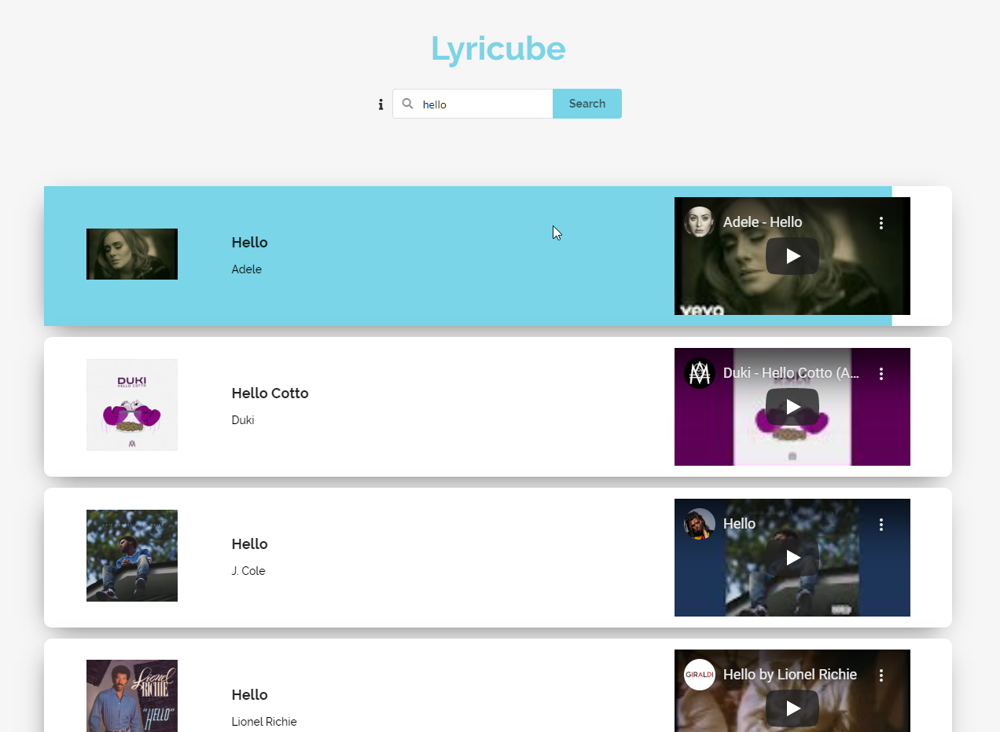

# The Lyricube app Brought to you by Lightwork

Sometimes you have a song stuck in your head or even after hearing a song you like but can't figure out who it's by or what the song's called. The Lyricube app allows the user to search part of the lyrics that they remember to populate the most popular songs with the lyrics entered as well as a YouTube video for ease of use.

## Technicalities:

For the creation of the app, we used:
- [Genius API](https://genius.com/developers): which allows us to input lyrics and returns popular songs that contain those lyrics.
- [YouTube API](https://developers.google.com/youtube): which allows us to input the song titles and artist names received and returns the top related videos for each song.
- [Rapid API](https://rapidapi.com/): Due to a CORS issue we encountered through the Genius API, we had to use Rapid API to bypass this issue.

For the styling of the application we used:
- [Semantic-UI](https://semantic-ui.com/): the core CSS framework for the styling, from buttons to layouts and popups.
- [Hover CSS](https://ianlunn.github.io/Hover/): this allowed us to animate the page in a simple yet effective way to grab the users attention by allowing the user to highlight the selected results by hovering over the area.
- [Google Fonts](https://fonts.google.com/): this had a larger library of font families to choose from as we weren't happy with the exiting font family range within Semantic-UI

## Project management

To manage the project we decided to use [Asana](https://app.asana.com/0/1174159538731249/board) as this allowed us to enter subtasks within each task to make the board cleaner and allowed us to tick off each one before completing the overriding task. It also kept the core functionalities of the other project management tools such as naming each section of tasks, appointing tasks to select individuals and setting a completion date.

## Functionality of the app:
- When the user hovers over the information icon, they are presented with how to get started with the app (see image 1: tooltip)
- When a user inputs a valid set of lyrics the app will send the lyrics to the Genius api to look for the most popular songs containing those lyrics
- Once the songs have been found and returned, Lyricube then selects the top 5 results and sends them off to the YouTube api to get the most related videos for each song
- Once all the information is gathered Lyricube populates the top 5 results with the single/album cover on the left, song title and artists in the middle and a playable YouTube video on the right (see image 2: results)
- When the user searches for different lyrics, the existing results are removed to present the new set of results
- When you hover over the search result, the results box animates is highlighted with a blue swipe animation (see image 3: highlighted results)
- If the input from the user is invalid or there is no search results, the user will be prompted to try again with valid lyrics (see image 4: lyrics error)
- To create a smooth experience, if the user clicks more than once to search, the app will only render the results once
- If there is an issue with returning results from the YouTube api, the user will be presented with a different error message to notify this. (see image 5: YouTube error)
- The user is presented with the opportunity to find out more about the apis used through the sticky footer that's generated at the bottom of the page (see image 6: footer)
- When the user is searching through a mobile media, the information is displayed vertically instead of horizontally (see image 7: mobile view)

## Problems encountered
Asana not trello or monday.com
CORS issue
Semantic-UI limitations
MusixMatch

## Future functionalities

## Image Examples

Image 1: tooltip 

Image 2: results 

Image 3: highlighted results 

image 4: lyrics error 

Image 5: YouTube error 

Image 6: footer 

Image 7: mobile view 

## Resources 
Genius API
YouTube API
Rapid API
Semantic-UI
Hover.css
Asana
